# Completando un CRUD en api-producto protegido con token

## Objetivo
Hacer una API REST con AWS Lambda con las operaciones CRUD y con Autenticacion en cada operación
Se completara la API de productos implementando funciones Lambda seguras (con token de acceso) para las siguientes operaciones:

- `CrearProducto` (POST) → Recibe `tenant_id`, `producto_id` y `nombre`, crea un nuevo producto.
- `ListarProductos` (POST) → Recibe `tenant_id` y devuelve todos los productos asociados.
- `BuscarProducto` (POST) → Recibe `tenant_id` y `producto_id`, retorna un producto específico.
- `ModificarProducto` (PUT) → Recibe `tenant_id`, `producto_id` y datos a modificar.
- `EliminarProducto` (DELETE) → Recibe `tenant_id` y `producto_id`.

Cada función Lambda se protege mediante validación de token a través de otro Lambda llamado `ValidarTokenAcceso`.

## Primeros pasos:

Se crea el recurso:

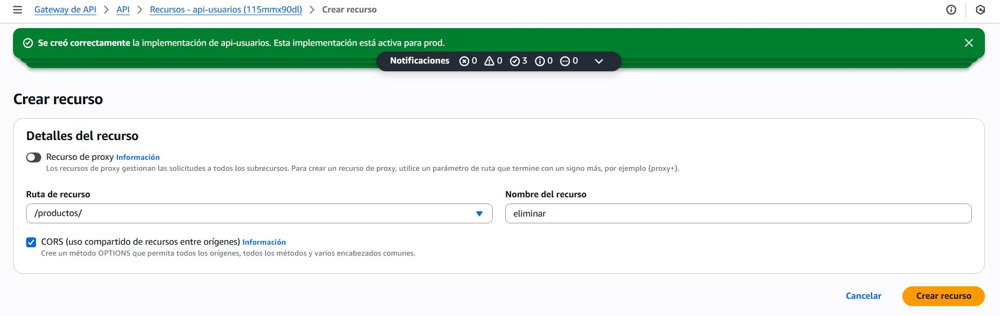

Se crea habilita CORS:

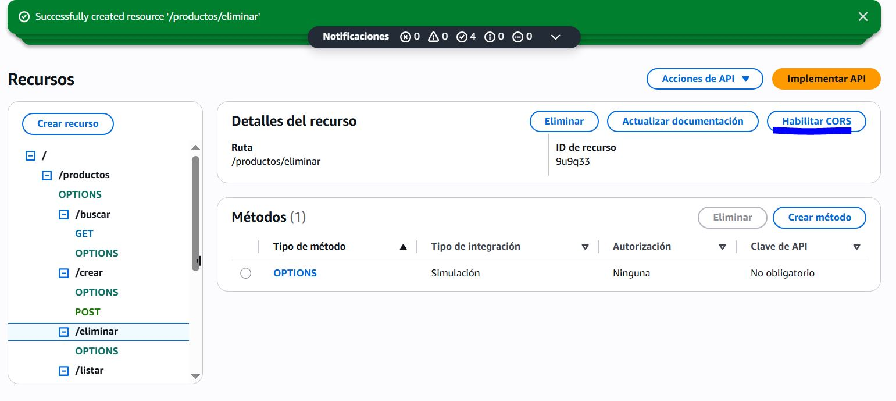

Se selecciona todo:

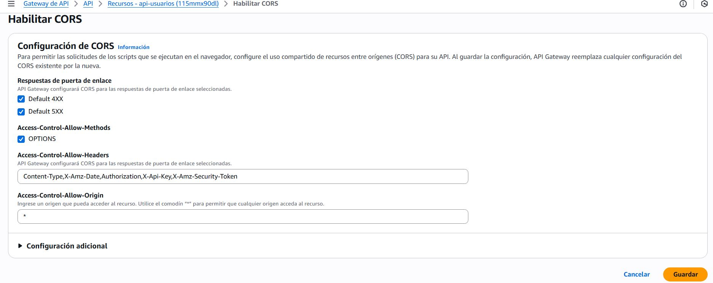

Luego se le crea su método:

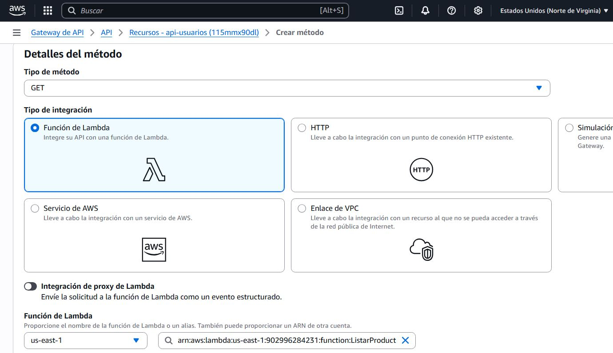

## Validación de Token

Todas las funciones inician extrayendo el header `Authorization`, que se pasa como token a la función `ValidarTokenAcceso`. Esta retorna `403 Forbidden` si el token no es válido. El flujo de validación es idéntico en todas las funciones para estandarización y seguridad.

---

## Función: ListarProductos

### Descripción

Obtiene todos los productos registrados bajo un mismo `tenant_id` utilizando la operación `query` de DynamoDB, aprovechando que `tenant_id` es la clave de partición.

### Lógica
- Se espera que el `tenant_id` llegue en el cuerpo del mensaje (`event['body']`).
- Se realiza la consulta con `KeyConditionExpression=Key('tenant_id').eq(...)`.

### Consideraciones
- Ideal para tiendas, supermercados u organizaciones que manejan productos de forma separada por cliente.

Codigo:

```py
import json
import boto3
from boto3.dynamodb.conditions import Key

def lambda_handler(event, context):
    # Validar token
    token = event['headers'].get('Authorization')
    lambda_client = boto3.client('lambda')
    validacion = lambda_client.invoke(
        FunctionName="ValidarTokenAcceso",
        InvocationType='RequestResponse',
        Payload=json.dumps({'token': token})
    )
    if json.loads(validacion['Payload'].read())['statusCode'] == 403:
        return {'statusCode': 403, 'body': 'Forbidden'}

    # Obtener body
    body = event['body']
    if isinstance(body, str):
        body = json.loads(body)

    tenant_id = body.get('tenant_id')
    if not tenant_id:
        return {
            'statusCode': 400,
            'body': 'Falta el campo tenant_id en el body.'
        }

    # Consultar productos de ese tenant
    table = boto3.resource('dynamodb').Table('t_productos')
    res = table.query(
        KeyConditionExpression=Key('tenant_id').eq(tenant_id)
    )

    return {
        'statusCode': 200,
        'body': json.dumps(res.get('Items', []))
    }
```

Código en producción:

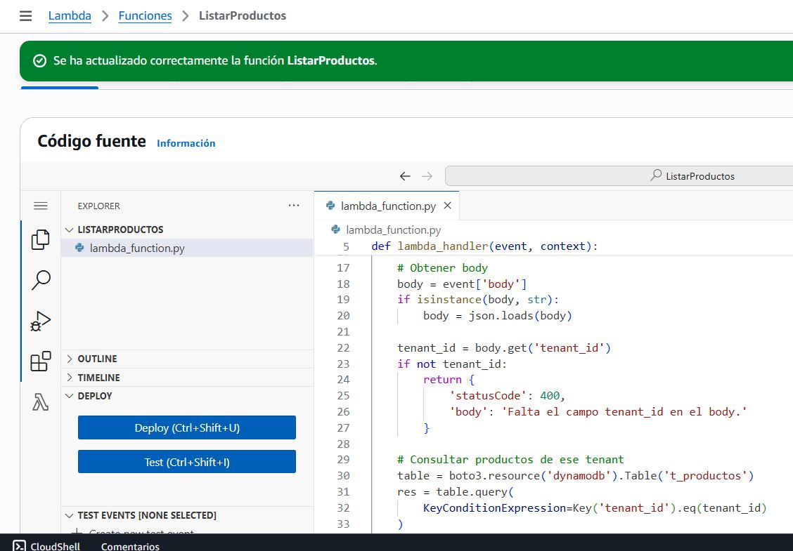

## Función: BuscarProducto

### Descripción

Devuelve un solo producto que coincida tanto con el `tenant_id` como con el `producto_id`.

### Lógica
- Usa operación `get_item` directamente con ambas claves (`PartitionKey` + `SortKey`).
- Se considera más eficiente que `query` si se conoce la clave exacta.

Code:
```py
import json
import boto3

def lambda_handler(event, context):
    # Validar token
    token = event['headers'].get('Authorization')
    lambda_client = boto3.client('lambda')
    validacion = lambda_client.invoke(
        FunctionName="ValidarTokenAcceso",
        InvocationType='RequestResponse',
        Payload=json.dumps({'token': token})
    )
    if json.loads(validacion['Payload'].read())['statusCode'] == 403:
        return {'statusCode': 403, 'body': 'Forbidden'}

    # Obtener body
    body = event['body']
    if isinstance(body, str):
        body = json.loads(body)

    tenant_id = body['tenant_id']
    producto_id = body['producto_id']

    # Buscar producto
    table = boto3.resource('dynamodb').Table('t_productos')
    res = table.get_item(Key={'tenant_id': tenant_id, 'producto_id': producto_id})

    return {
        'statusCode': 200,
        'body': json.dumps(res.get('Item', {}))
    }

```

## Función: ActualizarProducto

### Descripción

Permite actualizar uno o varios atributos de un producto identificado por `tenant_id` y `producto_id`.

### Lógica
- Utiliza `update_item` con `UpdateExpression` y `ExpressionAttributeValues`.
- Retorna los atributos modificados con `ReturnValues='UPDATED_NEW'`.

### Consideraciones
- El cuerpo debe incluir los campos: `tenant_id`, `producto_id` y un objeto `updates` con las propiedades a modificar.

Code:
```py
import json
import boto3

def lambda_handler(event, context):
    # Validar token
    token = event['headers'].get('Authorization')
    lambda_client = boto3.client('lambda')
    validacion = lambda_client.invoke(
        FunctionName="ValidarTokenAcceso",
        InvocationType='RequestResponse',
        Payload=json.dumps({'token': token})
    )
    if json.loads(validacion['Payload'].read())['statusCode'] == 403:
        return {'statusCode': 403, 'body': 'Forbidden'}

    # Obtener body
    body = event['body']
    if isinstance(body, str):
        body = json.loads(body)

    tenant_id = body['tenant_id']
    producto_id = body['producto_id']
    updates = body['updates']  # ejemplo: { "nombre": "Nuevo nombre" }

    # Generar expresiones de actualización
    update_expr = "SET " + ", ".join(f"{k} = :{k}" for k in updates)
    expr_attrs = {f":{k}": v for k, v in updates.items()}

    # Actualizar producto
    table = boto3.resource('dynamodb').Table('t_productos')
    res = table.update_item(
        Key={'tenant_id': tenant_id, 'producto_id': producto_id},
        UpdateExpression=update_expr,
        ExpressionAttributeValues=expr_attrs,
        ReturnValues='UPDATED_NEW'
    )

    return {
        'statusCode': 200,
        'body': json.dumps(res['Attributes'])
    }

```

En producción:

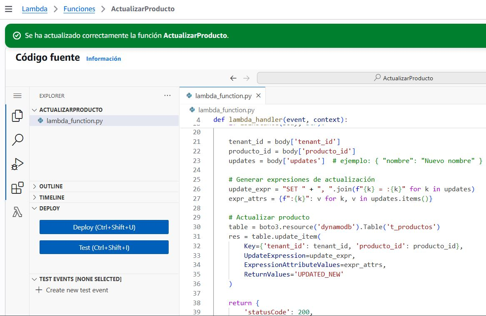

## Función: EliminarProducto

### Descripción

Elimina un producto de la base de datos DynamoDB dado su `tenant_id` y `producto_id`.

### Lógica
- Usa `delete_item` sobre la tabla `t_productos`.
- Elimina el registro sin necesidad de una lectura previa.

Code:
```py
import json
import boto3

def lambda_handler(event, context):
    # Validar token
    token = event['headers'].get('Authorization')
    lambda_client = boto3.client('lambda')
    validacion = lambda_client.invoke(
        FunctionName="ValidarTokenAcceso",
        InvocationType='RequestResponse',
        Payload=json.dumps({'token': token})
    )
    if json.loads(validacion['Payload'].read())['statusCode'] == 403:
        return {'statusCode': 403, 'body': 'Forbidden'}

    # Obtener body
    body = event['body']
    if isinstance(body, str):
        body = json.loads(body)

    tenant_id = body['tenant_id']
    producto_id = body['producto_id']

    # Eliminar producto
    table = boto3.resource('dynamodb').Table('t_productos')
    table.delete_item(Key={'tenant_id': tenant_id, 'producto_id': producto_id})

    return {
        'statusCode': 200,
        'body': f'Producto {producto_id} eliminado para tenant {tenant_id}'
    }

```

Código en producción:

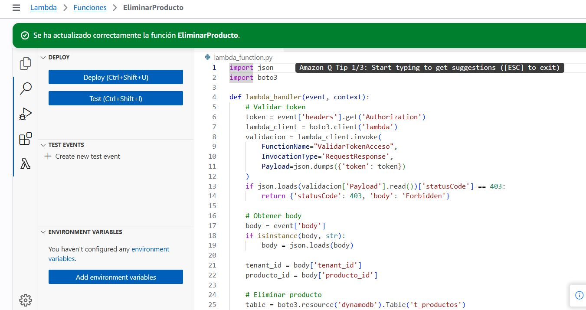

---

## Configuración adicional en API Gateway

Para que las funciones Lambda funcionen correctamente desde la API Gateway:

1. **Tiempo de ejecución**: se asignó hasta 30 segundos para evitar `timeout` en operaciones de DynamoDB.
2. **Habilitación de CORS**: necesario para aceptar peticiones desde frontends.
3. **Solicitud de integración**: habilitada para permitir el envío de headers (especialmente el token `Authorization`) desde el cliente a Lambda.

Se modifica el Tiempo de Ejecución:

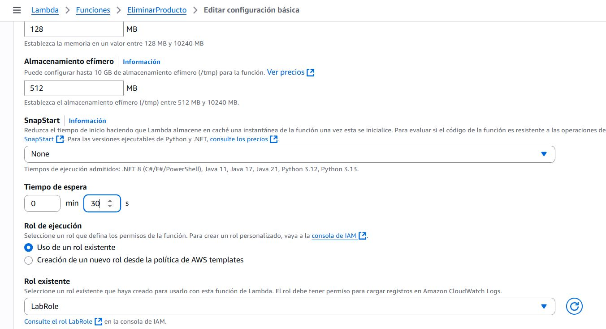

Se crea habilita CORS:


Se selecciona todo:


Luego se habilita la Solicitud de integración:

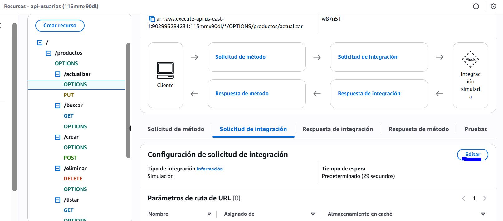

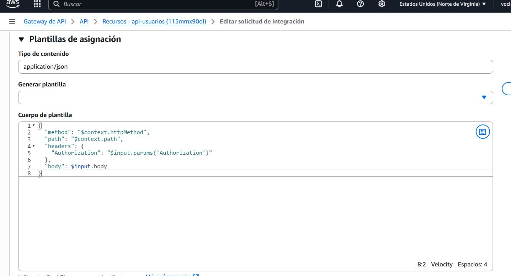

---

## Pruebas realizadas

| Función           | Entrada Ejemplo                                                                 | Resultado Esperado |
|------------------|----------------------------------------------------------------------------------|---------------------|
| `ListarProductos`| `{ "tenant_id": "PLAZA VEA" }`                                                  | Lista de productos  |
| `BuscarProducto` | `{ "tenant_id": "PLAZA VEA", "producto_id": "PVP01" }`                          | Detalles del producto |
| `ModificarProducto`| `{ "tenant_id": "PLAZA VEA", "producto_id": "PVP01", "updates": { "nombre": "Nuevo" } }`| Confirmación de actualización |
| `EliminarProducto`| `{ "tenant_id": "PLAZA VEA", "producto_id": "PVP01" }`                         | Código 204 - Eliminado |

Primero se hace el login:

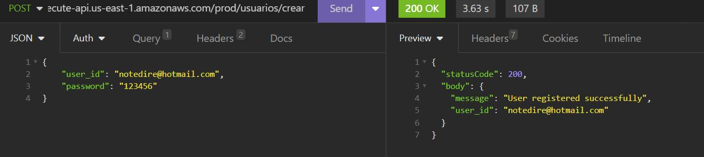

De ahi antes de hacer cualquier operacion CRUD, se pone el token como Header:

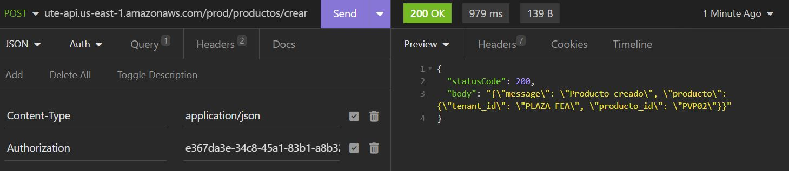

Prueba en CrearProductos:

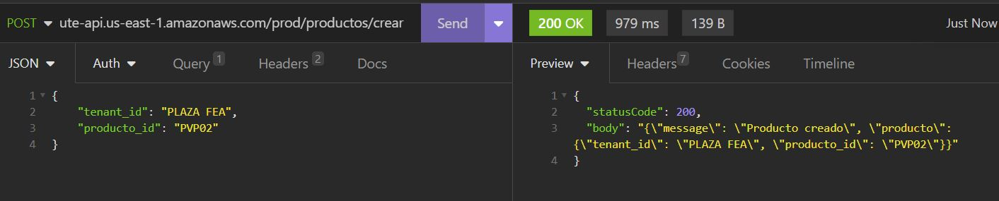

Prueba en ListarProductos:

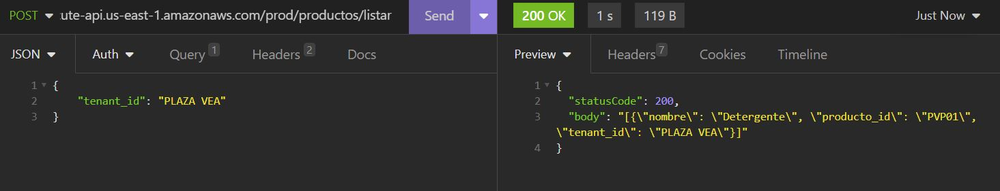

Se puede ver como se crean los nuevos elementos en la tabla de DynamoDB:

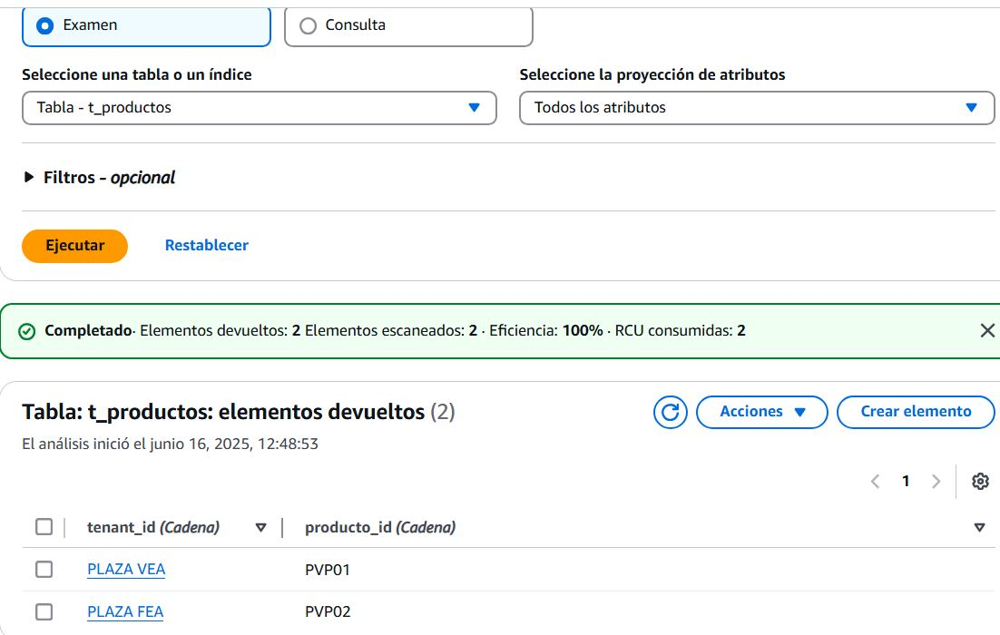

## Conclusión

Se completó exitosamente la API de productos protegida con token, permitiendo las operaciones CRUD básicas sobre una tabla DynamoDB multi-tenant. Cada Lambda fue implementado con protección de acceso, buena práctica en proyectos reales donde se requiere control y segmentación por cliente o tenant.


